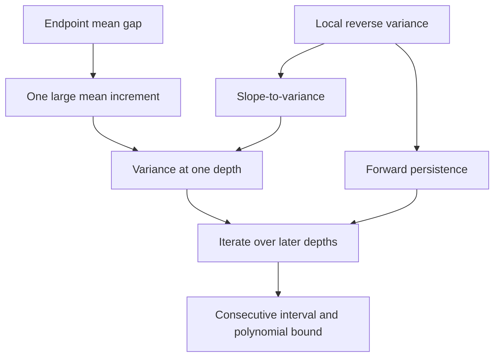

# Mathematical guide

[Repository overview](../README.md) · [Paper-to-code map](paper-mapping.md) ·
[Run the verification](reproduce.md)

This guide describes the formal statement and its proof without requiring Lean
syntax. The entry point in the source is [Main.lean](../Fluctuations/Main.lean).

## Objects and notation

The theorem concerns a process $F_d:\Omega\to\mathbb C$ on a probability space
$(\Omega,\mu)$. Each $F_d$ is square-integrable. For each depth, $\mathcal G_d$
is a sub-sigma-algebra of the ambient measurable space. Write

```math
m_d=\mathbb E[F_d],\qquad
V_d=\mathbb E\lvert F_d-m_d\rvert^2,\qquad
M_d=\mathbb E[F_{d+1}\mid\mathcal G_d].
```

| Mathematical object | Lean expression |
| --- | --- |
| Process at depth $d$ | `F d : Ω → ℂ` |
| Conditioning information $\mathcal G_d$ | `G d : MeasurableSpace Ω` |
| Square-integrability | `MemLp (F d) 2 μ` |
| Complex variance $V_d$ | `complexVariance μ (F d)` |
| Conditional expectation $M_d$ | `μ[F (d + 1) \| G d]` |
| Local reverse-variance condition | `LocalReverseVariance μ (G d) η (F d) (F (d + 1))` |

All declarations are in the namespace `Fluctuations`. The variance is a real,
nonnegative mean squared complex norm; it is not $\mathbb E(F-\mathbb EF)^2$.

## The two substantive inputs

**Mean change.** For natural depths $a<b$ and a real $\Delta\geq0$,

```math
\lvert m_b-m_a\rvert\geq\Delta.
```

**Local reverse variance.** A single real $\eta>0$ satisfies, at every depth
and almost everywhere,

```math
\mathbb E\!\left[\lvert F_{d+1}-M_d\rvert^2\mid\mathcal G_d\right]
\;\geq\;\eta\lvert M_d-F_d\rvert^2.
```

The condition uses mathlib's conditional expectation. It is an argument of the
theorem, not a new global axiom. Square-integrability, probability normalization,
and the inclusion of each $\mathcal G_d$ in the ambient sigma-algebra are also
explicit assumptions.

The final theorem assumes the local inequality at all natural depths. It does
not additionally require the process to be adapted or the sigma-algebras to be
nested. For a circuit application, establishing the stated inputs for the actual
process remains a mathematical obligation.

## How the proof works



1. **Find a large increment.** Telescoping and the triangle inequality imply
   that some $a<d_*\leq b$ has
   $\lvert m_{d_*}-m_{d_*-1}\rvert\geq\Delta/(b-a)$.
   See `exists_large_increment` in [Window.lean](../Fluctuations/Window.lean#L15).

2. **Convert the increment into variance.** Total variance and the
   squared-mean bound give
   $V_{d+1}\geq\eta\lvert m_{d+1}-m_d\rvert^2$.
   Thus $V_{d_*}\geq\eta\Delta^2/(b-a)^2$.
   See `slope_to_variance` in [Probability.lean](../Fluctuations/Probability.lean#L130).

3. **Prove persistence.** A weighted square inequality and the local condition
   imply $V_{d+1}\geq\kappa V_d$, where $\kappa=\eta/(1+\eta)\in(0,1)$.
   See `forward_persistence` in
   [WeightedVariance.lean](../Fluctuations/WeightedVariance.lean#L63).

4. **Iterate.** The same selected depth works for every $r\in\mathbb N$:

   ```math
   V_{d_*+r}\geq\eta\kappa^r\frac{\Delta^2}{(b-a)^2}.
   ```

5. **Obtain the paper's bound.** Set $\Delta=1/2$, fix $R\in\mathbb N$, and
   use $b-a\leq P$. Because $\kappa^r\geq\kappa^R$ for $r\leq R$,

   ```math
   V_{d_*+r}\geq\frac{\eta\kappa^R}{4P^2}\qquad(0\leq r\leq R).
   ```

   The interval $\{d_*,\ldots,d_*+R\}$ contains exactly $R+1$ depths and
   is contained in $\{a+1,\ldots,b+R\}$.

Slope-to-variance and persistence are **proved**, not assumed in the final
probabilistic theorems. The deterministic lemmas in `Window.lean` take these
two intermediate bounds as inputs; `Main.lean` supplies their proofs.

## Choose the theorem you need

| Declaration | Use it for |
| --- | --- |
| [`transition_window`](../Fluctuations/Main.lean#L18) | Any nonnegative mean gap $\Delta$; the bound for every later offset |
| [`theorem_VI_14`](../Fluctuations/Main.lean#L39) | Mean gap $1/2$, a width bound $P$, and one lower bound for all $r\leq R$ |
| [`theorem_VI_14_interval`](../Fluctuations/Main.lean#L78) | The explicit finite interval, its cardinality and location |
| [`theorem_VI_14_family`](../Fluctuations/Main.lean#L107) | A polynomial width bound and a constant uniform in system size |

In the family result, the probability space may depend on $n$. For a fixed
$R$ and an $n$-independent $\eta>0$, the proof chooses

```math
c(\eta,R)=\frac{\eta}{4}\left(\frac{\eta}{1+\eta}\right)^R
```

**before** quantifying over $n\geq n_0$. It then obtains a suitable depth for
each $n$. The polynomial is an actual `Polynomial ℝ`, with evaluation
`p.eval (n : ℝ)`. Its positivity on the relevant sizes follows from the
positive transition width and the assumed width bound.

This is an inverse-polynomial bound for fixed $R$. Letting $R$ grow with $n$
changes the prefactor, and the theorem does not claim a positive lower bound
uniform over arbitrarily many later depths.

## What this says about the paper

For the intended application, substitute the paper's OTOC for $F_d$, set
$a=d_{\rm lc}$ and $b=d_{\rm mc}$, and provide the endpoint gap and local
condition. The circuit construction, OTOC matrix formula, and arguments using
light cones, Haar averages, or moment control to establish these inputs are
outside this formalization. So are the paper's other results and any
computational quantum-advantage claim.

To review that boundary, use the [paper-to-code map](paper-mapping.md) and
[review checklist](../REVIEW.md). To inspect the fully elaborated theorem
types and their dependencies, follow the [verification instructions](reproduce.md).
